# ♿ Disability Schemes Chatbot — System Documentation

Welcome to the technical documentation for the **Disability Schemes Chatbot**. This system is an intelligent, multilingual, GPU-accelerated Retrieval-Augmented Generation (RAG) assistant designed to help persons with disabilities and their families in India find government welfare schemes.

---

## 🏗️ System Pipeline Architecture

The system consists of three main layers:
1. **Frontend UI & Translation** (`app.py`, `language_utils.py`): Handles bilingual user chat/voice input and translates back and forth between 13 Indian languages and English.
2. **Backend & RAG Pipeline** (`rag_pipeline.py`, `prompts.py`): Rephrases conversational history, retrieves context using a hybrid search, reranks results, and generates answers using Groq's LLM under strict hallucination policies.
3. **Data Agents & Indexing** (`scrape_schemes.py`, `embed_docs.py`, `update_all.py`): Scrapes web portals/PDFs, converts them into markdown documents, builds vector search database indexes, and executes automated checks.

```mermaid
graph TD
    %% Scraper & Embedder Pipeline
    subgraph Data Agents & Ingestion
        A[run_updates.bat / update_all.py] --> B[scrape_schemes.py]
        B -->|Scrapes Web & PDFs| C[knowledge-base/sources.json]
        B -->|Calls Groq LLM| D[llama-3.3-70b-versatile]
        D -->|Saves Structured Markdown| E[knowledge-base/*/*.md]
        A --> F[embed_docs.py]
        E -->|Reads Markdown Docs| F
        F -->|HuggingFace all-MiniLM-L6-v2| G[FAISS Vector Store]
        G -->|Saved locally| H[scripts/vector_store/]
    end

    %% User Interaction Pipeline
    subgraph Frontend UI & Backend RAG
        UI[app.py - Streamlit Interface] -->|User Input: Voice or Text| TransIn[language_utils.py]
        TransIn -->|Translate to English| RAG[rag_pipeline.py]
        RAG -->|1. Condense Question with History| LLM_Condense[Groq llama-3.1-8b-instant]
        RAG -->|2. Retrieval: Hybrid Search| R_Hybrid[Ensemble: FAISS + BM25]
        R_Hybrid -->|3. Reranking| R_Rerank[FlashrankRerank]
        R_Rerank -->|4. Strict Prompts & Context| LLM_Generate[Groq llama-3.1-8b-instant]
        LLM_Generate -->|English Answer + Sources| TransOut[language_utils.py]
        TransOut -->|Translate back to User Lang| UI
    end
```



---

## 📂 Consolidated Documentation Files

To make it easy to understand the system without reading many individual documents, the architecture is grouped into these guides:

### 📖 [Simplified Project Brief (Easy Lang)](file:///c:/Users/Deepti%20Prasad/Desktop/disability-schemes-chatbot/docs/project_brief.md)
An easy-to-read explanation of what RAG and LLMs do, the system features, and a step-by-step walkthrough of the pipeline in plain English.

### 1. 🖥️ [Frontend UI & Translation Guide](file:///c:/Users/Deepti%20Prasad/Desktop/disability-schemes-chatbot/docs/frontend_ui.md)
Explains the user interface ([app.py](file:///c:/Users/Deepti%20Prasad/Desktop/disability-schemes-chatbot/chatbot/app.py)), speech-to-text voice input capturing, user session/chat history management, and the translation utility module ([language_utils.py](file:///c:/Users/Deepti%20Prasad/Desktop/disability-schemes-chatbot/chatbot/language_utils.py)).

### 2. ⚙️ [Backend RAG Pipeline Guide](file:///c:/Users/Deepti%20Prasad/Desktop/disability-schemes-chatbot/docs/backend_rag.md)
Covers the core RAG retrieval flow ([rag_pipeline.py](file:///c:/Users/Deepti%20Prasad/Desktop/disability-schemes-chatbot/chatbot/rag_pipeline.py)), custom hybrid retrievers (FAISS + BM25), FlashRank reranking layers, prompt templates ([prompts.py](file:///c:/Users/Deepti%20Prasad/Desktop/disability-schemes-chatbot/chatbot/prompts.py)), memory condensation, and strict hallucination guardrails.

### 3. 🤖 [Data Agents & Automation Guide](file:///c:/Users/Deepti%20Prasad/Desktop/disability-schemes-chatbot/docs/data_agents.md)
Covers background ingestion scripts: scraping websites/PDFs using LLMs ([scrape_schemes.py](file:///c:/Users/Deepti%20Prasad/Desktop/disability-schemes-chatbot/scripts/scrape_schemes.py)), compiling index databases ([embed_docs.py](file:///c:/Users/Deepti%20Prasad/Desktop/disability-schemes-chatbot/scripts/embed_docs.py)), training dataset generation ([prepare_finetune_data.py](file:///c:/Users/Deepti%20Prasad/Desktop/disability-schemes-chatbot/scripts/prepare_finetune_data.py)), and automated unit test assertions ([test_logic.py](file:///c:/Users/Deepti%20Prasad/Desktop/disability-schemes-chatbot/scripts/test_logic.py)).

---

## 🚀 Quick Execution Guide

* **Update Knowledge Base**:
  ```bash
  python scripts/update_all.py
  ```
  *(or double-click [run_updates.bat](file:///c:/Users/Deepti%20Prasad/Desktop/disability-schemes-chatbot/run_updates.bat) on Windows)*

* **Run Chatbot Streamlit App**:
  ```bash
  streamlit run chatbot/app.py
  ```
