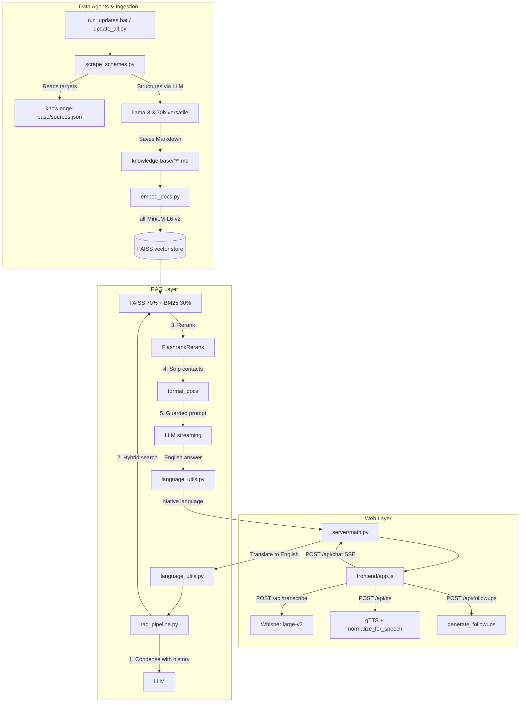

# ♿ Disability Schemes Chatbot — System Documentation

Technical documentation for the **Disability Schemes Chatbot**: an intelligent, multilingual, voice-enabled Retrieval-Augmented Generation (RAG) assistant that helps persons with disabilities and their families in India find government welfare schemes.

---

## 🏗️ System Architecture

The system has four layers:

1. **Web layer** (`server/main.py`, `frontend/`) — FastAPI serves a streaming JSON/SSE API and hosts a vanilla-JS single-page chat UI. No build step, no Node toolchain.
2. **Voice & language layer** (`voice_utils.py`, `language_utils.py`) — Whisper speech-to-text with automatic language detection, gTTS speech output with Markdown stripped, and two-way translation across 13 Indian languages.
3. **RAG layer** (`rag_pipeline.py`) — condenses follow-up questions, retrieves with hybrid search, reranks, generates under strict guardrails, streams tokens, and produces contextual follow-up suggestions.
4. **Data agents** (`scripts/`) — scrape official portals and PDFs, structure them into Markdown, and build the FAISS index.



---

## 📂 Documentation Guides

### 📖 [Simplified Project Brief](project_brief.md)
Plain-English explanation of what every folder and file does, and how a question travels through the system.

### 1. 🖥️ [Frontend, API & Voice Guide](frontend_ui.md)
The FastAPI endpoints, the vanilla-JS client, SSE streaming, voice input/output, follow-up chips, accessibility, and the translation module.

### 2. ⚙️ [Backend RAG Pipeline Guide](backend_rag.md)
Hybrid retrieval, FlashRank reranking, prompt templates, hallucination guardrails, response formatting rules, streaming, follow-up generation, and LLM provider configuration.

### 3. 🤖 [Data Agents & Automation Guide](data_agents.md)
Scraping agents, indexing, GitHub Actions automation, fine-tuning dataset generation, and regression tests.

---

## 🚀 Quick Execution Guide

**Update the knowledge base**
```bash
python scripts/update_all.py     # or run_updates.bat on Windows
```

**Run the web app** (primary interface)
```bash
python -m uvicorn server.main:app --port 8000
# open http://localhost:8000
```

Always run from the **project root** — the pipeline resolves `scripts/vector_store` relatively.

---

## 🔧 LLM provider configuration

Set `LLM_PROVIDER` in `.env` to `groq` (default), `ollama` (fully local), or `openai`.

If Groq returns **`403 Access denied`**, you are behind a **VPN/proxy** — Groq blocks VPN and datacenter IPs. Either disconnect the VPN or switch to `LLM_PROVIDER=ollama`. See [backend_rag.md](backend_rag.md#-llm-provider-configuration).
