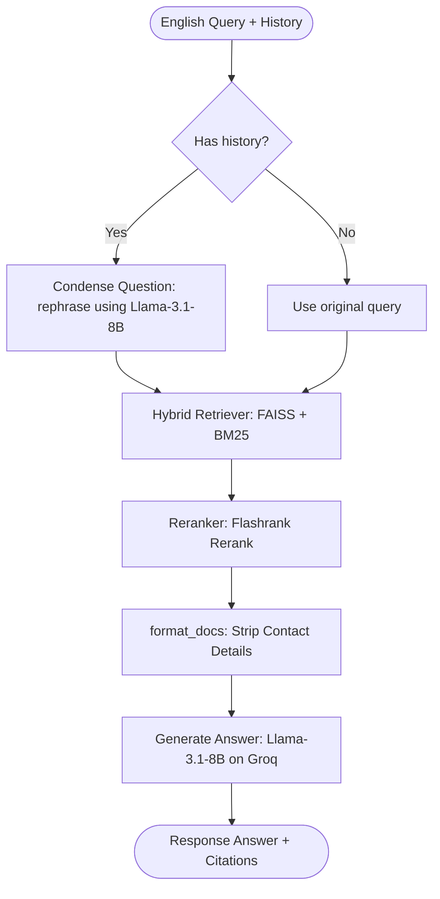

# ⚙️ Core Backend RAG Pipeline Guide

This guide details the core backend Retrieval-Augmented Generation (RAG) pipeline responsible for context retrieval, reranking, and response generation. The primary files discussed are:
1. **RAG Pipeline Engine**: [rag_pipeline.py](file:///c:/Users/Deepti%20Prasad/Desktop/disability-schemes-chatbot/chatbot/rag_pipeline.py)
2. **Standard Prompt System**: [prompts.py](file:///c:/Users/Deepti%20Prasad/Desktop/disability-schemes-chatbot/chatbot/prompts.py)

---

## 🛠️ Step-by-Step Retrieval & Generation Pipeline

When a user query is received, the RAG engine processes it through the following logical steps:



### Step 1: Condensation of Follow-Up Queries
If a conversation contains history, the engine compiles the dialogue log and rephrases the new question into a standalone query using `CONDENSE_QUESTION_PROMPT` on a **Groq** backend. This ensures references like *"Is it free?"* or *"Who applies?"* carry over context from previous turns.

### Step 2: Hybrid Search Retrieval
The pipeline queries a custom **EnsembleRetriever** that runs two search algorithms in parallel to search the scheme database:
1. **Semantic Search (FAISS)**: Uses `all-MiniLM-L6-v2` embeddings to search by conceptual meaning. Weighted at **70%** of the score.
2. **Keyword Search (BM25)**: Evaluates exact terms, numbers, and acronyms. Weighted at **30%** of the score. The BM25 index is generated dynamically from the FAISS database to ensure they cover the same data.

### Step 3: FlashRank Reranking
The hybrid search returns the top 10 documents. To prevent the LLM from missing relevant information (the "lost in the middle" problem), a `FlashrankRerank` compressor reranks these candidates. Only the most contextually relevant chunks are passed to the LLM.

### Step 4: Formatting & Contact Stripping
To stop the LLM from confusing PIN codes, phone numbers, or administrative IDs with financial grant amounts (a common RAG hallucination), the `format_docs` function uses regex to strip out contact-heavy sections from the retrieved document text:
```python
def format_docs(docs):
    context = ""
    for doc in docs:
        content = doc.page_content
        # Remove contacts, addresses, phones, and emails
        content = re.sub(r'## Contact.*', '', content, flags=re.DOTALL | re.IGNORECASE)
        content = re.sub(r'Address:.*', '', content, flags=re.IGNORECASE)
        content = re.sub(r'Phone:.*', '', content, flags=re.IGNORECASE)
        content = re.sub(r'Email:.*', '', content, flags=re.IGNORECASE)
        context += f"\n---\n{content}\n"
    return context
```

### Step 5: Answer Generation (With Strict Guardrails)
The prompt and formatted context are sent to `llama-3.1-8b-instant` on Groq, operating at a low temperature of `0.1` for deterministic answers.

---

## 🔒 Crucial RAG Guardrails & Persona Rules

The pipeline enforces strict system prompt instructions to handle specific constraints safely:

### 1. Zero-Hallucination Policy
* The LLM must answer **ONLY** using the provided context. If information is missing, it must return a standard fallback message instead of guessing details.
* It must not invent user details. If age, income, or disability status is not specified, it uses general terms and asks the user for clarification.
* Financial benefits must only be stated if explicitly described as a "Pension", "Grant", or "Scholarship amount".

### 2. Negative Constraints & Non-Student Status
If the user indicates a beneficiary **cannot study** or is **not in school**, the model must exclude educational schemes and focus instead on:
* **Niramaya** (Health Insurance)
* **Subsistence Allowance** (Monthly Pension)
* **National Trust Residential Care** (Samarth or Gharaunda schemes)

---

## 🔑 Key Entrypoints in `rag_pipeline.py`

* **`load_pipeline() -> Chain`**:
  * Automatically sets device configuration (uses GPU/`cuda` if available, otherwise defaults to `cpu`).
  * Loads the local FAISS index, initializes BM25, and chains the components using LangChain Expression Language (LCEL).
* **`ask(question: str, chat_history: list = None) -> dict`**:
  * Entrypoint called by the frontend.
  * Formats history items, runs the pipeline, gets citations from the ensemble retriever, and returns a dictionary with the answer and source document names.
