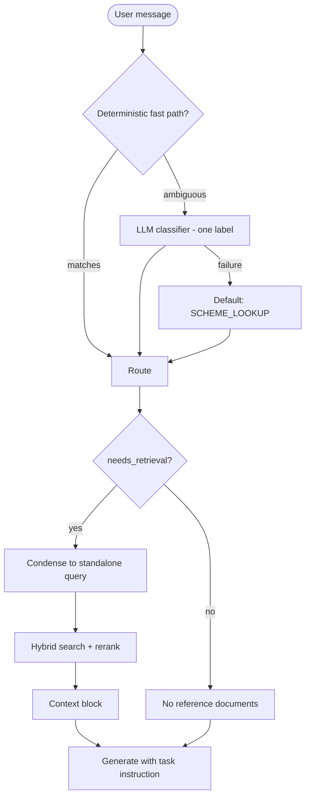
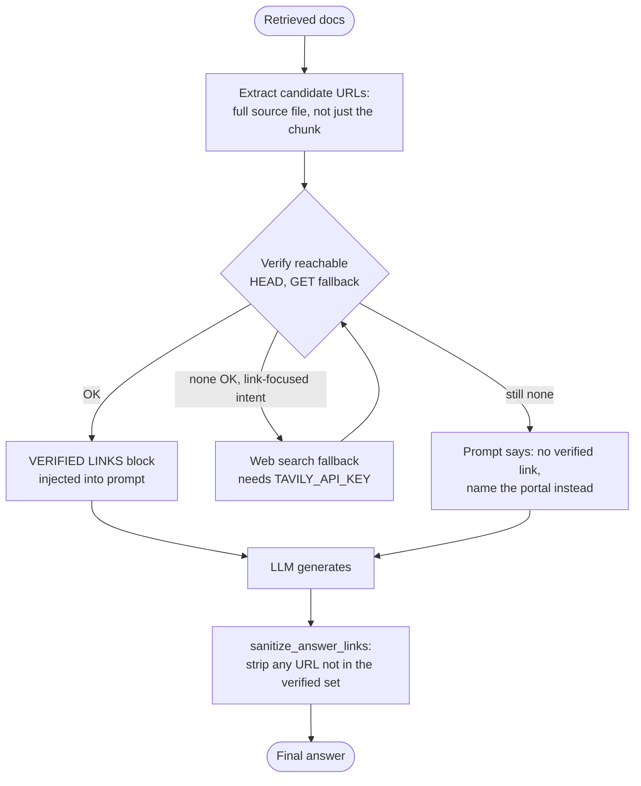
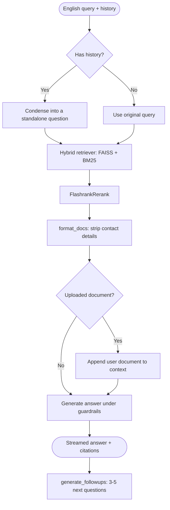

# ⚙️ Core Backend RAG Pipeline Guide

This guide details the RAG pipeline responsible for routing, retrieval, reranking, generation, streaming, and follow-up suggestions. Primary files: **`chatbot/router.py`** and **`chatbot/rag_pipeline.py`**.

---

## 🚦 Intent Routing (read this first)

The pipeline is **router-first**. Earlier it treated every message as a retrieval task — it always retrieved, always injected the whole conversation, and always aimed at the same sectioned scheme layout. A request like *"give me the application form link, and if I have to write an application, write it in proper format"* therefore came back as another copy of the scheme summary: there was no concept of "writing a document" as a distinct task, and the retrieved scheme text crowded out the real request.

`chatbot/router.py` now classifies every message first and returns a `Route` that decides **whether to retrieve at all**, **how much history is relevant**, and **what the task actually is**.



### Routing table

| Intent | Retrieves? | Depth | History | Behaviour |
|---|---|---|---|---|
| `SCHEME_LOOKUP` | ✅ | narrow | facts | Full sectioned layout (💰 / ✅ / 📝 / 📄 / 📞) for the best-fit few schemes |
| `LIST_ALL` | ✅ | **broad** | facts | Numbered, categorized enumeration of every distinct scheme found — no per-scheme sections |
| `COMPARE` | ✅ | **broad** | facts | Markdown comparison table across schemes, then a reasoned recommendation |
| `ELIGIBILITY` | ✅ | narrow | facts | Verdict first, then the deciding criteria |
| `RESOURCE_LINK` | ✅ | narrow | none | Link first, no headings, **never invents a URL** |
| `WRITE_DOCUMENT` | ✅ | narrow | facts | Outputs the **actual letter/application** with placeholders |
| `STEPS` | ✅ | narrow | none | Only the numbered application procedure — no scheme description |
| `EXPLAIN` | ✅ | narrow | none | Explains only that item or form field |
| `SUMMARIZE` | ❌ | — | full | Recaps the conversation |
| `SMALL_TALK` | ❌ | — | none | Brief friendly reply |
| `GENERAL` | ❌ | — | facts | Answers from the LLM's own reasoning |

A presentation request — *"put this in a table"*, *"as a checklist"* — is not its own intent; it can modify any of the above, so `router.format_hint_instruction()` layers an extra directive onto whichever route was classified, per turn.

### Why LIST_ALL and COMPARE needed a second retriever, not just a new prompt

`FlashrankRerank()` defaults to `top_n=3`. Every request — regardless of intent — was silently capped to 3 reranked chunks, often from the same one or two schemes. That's invisible for a single-scheme question but structurally breaks *"list all schemes"* or *"compare X and Y"*: the model can never see more than 3 fragments no matter what instruction it's given. `load_pipeline()` now builds a second, wider pipeline (`k=20` per retriever instead of 10, `FlashrankRerank(top_n=15)` instead of the default 3) stored as `retriever_broad`; `Route.retrieval_depth` picks which one `_build_prompt_inputs` uses. Confirmed live: the same query returns 3 docs on the narrow retriever and 15 on the broad one.

### Classification strategy
1. **Deterministic fast path** — unambiguous regexes (greetings, recap, "write an application", "list all schemes", "compare X and Y", "how do I apply", bare link requests). Zero latency. Ordered so writing dominates a bare "link" mention (the composite *"link + write it"* case), and compare/list-all are checked before the generic link regex so an incidental "portal" mention in a compare question doesn't misroute it.
2. **LLM classifier** — one near-zero-token call at `temperature=0`, with few-shot examples covering all 11 intents. Needed because composite requests require judgement; the examples are what stop *"Scholarships for a visually impaired college student?"* being misread as an eligibility question.
3. **Fallback** — any failure defaults to `SCHEME_LOOKUP`, the original behaviour, so classification can never break a conversation.

**Known edge case:** a composite request that mixes a content question with a bare formatting instruction — e.g. *"what documents are needed, put it in a table"* — can occasionally be misclassified by the LLM step (observed once as `WRITE_DOCUMENT` instead of `SCHEME_LOOKUP`). The format-hint layer still produces a correct table regardless of which route fired, so the answer comes out right, but the reported `intent` label may not match. Tightening this further would mean either more few-shot examples or a rule that a bare format hint alone never changes the *content* intent.

### History scoping
- `none` — the request stands alone; prior turns would only invite repetition.
- `facts` — user turns in full (they carry constraints like *"cannot study"*), past **assistant** turns clipped to `ASSISTANT_CLIP` (220 chars) and relabelled *"You already answered…"*. Handing the model its own full previous answer was the direct cause of the repetition loop.
- `full` — untruncated, used only for an explicit recap where the text is the point.

> **Web search** for scheme content is not implemented. The `GENERAL` route deliberately answers from the model's own reasoning and states plainly when something is outside the knowledge base, rather than forcing an unrelated scheme summary. (Web search for *link verification* is separate — see below.)

---

## 🔗 Link verification (never hallucinate a URL)

Primary file: **`chatbot/link_utils.py`**.

The LLM used to be free to type any URL it recalled from training data — which is exactly how it ends up citing dead or invented links. Now a link can reach the user only if it was checked reachable *right now*:



**Why retrieval alone wasn't enough.** Each retrieved "document" is really a ~500-char chunk from `RecursiveCharacterTextSplitter`, and the splitter puts a scheme's `source_url:` frontmatter in its own chunk — separate from the chunk that semantically matches the query. So a naive "grab URLs from the retrieved text" approach missed a scheme's own, already-scraped official URL most of the time. The fix: `extract_candidates_from_docs` resolves each retrieved chunk's source file via `doc.metadata["source"]` and reads the **whole file**, not just the fragment that was retrieved.

**Verification is deliberately lenient about ambiguous failures.** Many `.gov.in` sites reject `HEAD` requests or bot-like traffic with a 403/405, or time out under load — that is not the same as the link being dead (this project's own scraper hit the identical issue against GitHub-hosted runners). Status is classified as:

| Status | Meaning | Treated as |
|---|---|---|
| `OK` | 2xx/3xx after a GET fallback if HEAD was rejected | Safe to present |
| `NOT_FOUND` | explicit 404 | Definitively broken |
| `DNS_ERROR` | domain does not resolve (`NameResolutionError`) | Definitively broken |
| `UNCONFIRMED` | 403/405/5xx/timeout | Ambiguous — could be transient or bot-blocking, not assumed dead |

**Escalation to a live web search** (`web_search_official`, via Tavily — set `TAVILY_API_KEY`) only fires when nothing in the knowledge base verified AND the request is actually link-focused (`RESOURCE_LINK`, `WRITE_DOCUMENT`, or a link-retry turn) — not on every scheme lookup, to avoid unnecessary external calls and latency. Without a key configured, the assistant tells the user honestly that no verified link could be found rather than guessing.

**"That link isn't working"** is its own detection (`router.is_link_retry`), which excludes the URL from the prior assistant turn from the new candidate set and forces the web-search escalation, so the same broken link is never repeated.

**Sanitization is a deterministic backstop.** Prompting alone cannot guarantee a small model never types a link from memory despite instructions, so `sanitize_answer_links` runs on the full generated text before it reaches the user: an unverified bare URL becomes a plain note, and an unverified `[text](url)` markdown link becomes bare text (not a broken hyperlink pointing at a placeholder). This is why streaming applies it to the *assembled* answer rather than token-by-token — a URL can span several tokens, and the frontend already replaces the live-streamed text with the SSE `final` event's answer (the same mechanism translation already relies on).

---

## 🛠️ Retrieval & Generation Pipeline



### Step 1 — Condensing follow-up queries
When history exists, `CONDENSE_QUESTION_PROMPT` rewrites the new message into a standalone question, so *"Is it free?"* or *"What documents?"* inherit the earlier subject.

### Step 2 — Hybrid search
An `EnsembleRetriever` runs two retrievers in parallel:
1. **Semantic (FAISS)** — `all-MiniLM-L6-v2` embeddings, weighted **70%**.
2. **Keyword (BM25)** — exact terms, numbers, acronyms, weighted **30%**. The BM25 index is rebuilt from the FAISS docstore so both cover identical data.

### Step 3 — FlashRank reranking
The top 10 candidates are reranked by `FlashrankRerank` inside a `ContextualCompressionRetriever`, mitigating the "lost in the middle" problem.

### Step 4 — Formatting & contact stripping
`format_docs()` strips contact-heavy sections so the LLM cannot mistake a PIN code or phone number for a grant amount:

```python
content = re.sub(r'## Contact.*', '', content, flags=re.DOTALL | re.IGNORECASE)
content = re.sub(r'Address:.*',   '', content, flags=re.IGNORECASE)
content = re.sub(r'Phone:.*',     '', content, flags=re.IGNORECASE)
content = re.sub(r'Email:.*',     '', content, flags=re.IGNORECASE)
```

Any text uploaded through `/api/upload` is appended here as a clearly-labelled *"Document uploaded by the user"* block (capped at 6,000 characters).

### Step 5 — Generation
The guarded prompt plus context goes to the configured LLM at temperature `0.1` for deterministic answers. The last 8 conversation turns are injected as `{chat_history}` so the model can honour details the user already provided.

---

## 🔒 Guardrails & Persona Rules

### 1. Zero-hallucination policy
- Answer **only** from the provided context; never invent user details such as age, income, or disability percentage.
- Never treat a large number (PIN code, phone number) as a financial benefit — only amounts explicitly labelled *Grant*, *Pension*, *Allowance*, or *Scholarship amount*.

### 2. Negative constraints
If the beneficiary **cannot study** or is **not in school**, educational schemes must be excluded, focusing instead on **Niramaya** (health insurance), **Subsistence Allowance** (pension), and **National Trust residential care** (Samarth / Gharaunda).

### 3. Adaptive conversation
- Never re-ask for a detail already provided — read the conversation and use it.
- Broad question with key details missing → give a short useful overview **first**, then at most **two** targeted follow-up questions.
- Fully specified request → answer directly and ask nothing.
- Match the user's level of detail: short question, concise answer.

### 4. Response formatting
Answers must be skimmable Markdown:
- A 1–2 sentence **bottom line** first, with no heading above it.
- `##` headings only where relevant: `💰 Financial benefits`, `✅ Who can apply`, `📝 How to apply`, `📄 Documents needed`, `📞 Where to go`.
- Blank line between every section; `-` bullets for facts, numbered lists for processes.
- **Bold** every amount, deadline, percentage, scheme name and form number; one `>` blockquote for the single most important caveat.
- Nothing longer than three sentences without bullets; ~250 words unless more is requested.

---

## 💡 Follow-up Suggestions

`generate_followups(question, answer, chat_history)` asks the LLM for 3–5 short questions **the user would ask next**, given the latest turn. It runs at temperature `0.4` for variety, on a cached LLM instance.

`_parse_followups()` hardens the output: it strips bullets/numbering/quotes, drops anything without a `?` or outside 8–90 characters, de-duplicates, and caps the list. Any failure returns `[]`, so the UI simply shows no chips — suggestions are never allowed to break a conversation.

Because generation is exposed on its own endpoint (`/api/followups`) rather than bundled into the chat stream, the answer renders immediately and the chips arrive a moment later.

---

## 🔧 LLM Provider Configuration

`make_llm(temperature)` builds the chat model from the environment, so the app is **not hard-locked to one provider** — a single point of failure that previously took the whole chatbot down whenever Groq was unreachable.

| `LLM_PROVIDER` | Backend | Relevant variables |
|---|---|---|
| `groq` *(default)* | Groq cloud | `GROQ_API_KEY`, `GROQ_MODEL` |
| `ollama` | **Local** model, no external network | `OLLAMA_MODEL`, `OLLAMA_BASE_URL` |
| `openai` | Any OpenAI-compatible endpoint | `OPENAI_API_KEY`, `OPENAI_MODEL`, `OPENAI_BASE_URL` |

Provider modules are imported lazily, so unused SDKs are never required at startup.

### Troubleshooting: `403 — Access denied. Please check your network settings`

This is a **network-edge block by Groq, not an application bug and not an invalid key**. Groq refuses connections from **VPN and datacenter IP ranges** before the request is processed. Confirm by checking your egress IP: if the ASN belongs to a hosting/VPN provider (M247, DigitalOcean, etc.), that is the cause.

**Fixes:** disconnect the VPN/proxy, switch networks (a phone hotspot is the fastest test), or run fully locally:

```bash
ollama pull llama3.1
# .env
LLM_PROVIDER=ollama
```

> Note: `/api/transcribe` also uses Groq (Whisper), so voice input is affected by the same block even after switching the chat LLM to Ollama.

---

## 🔑 Key Entrypoints

| Function | Purpose |
|---|---|
| `classify(question, history)` *(router.py)* | Resolves a message to a `Route`. |
| `load_pipeline()` | Selects CUDA/CPU, loads FAISS, builds BM25 + ensemble + reranker, and returns the cached component set. |
| `route_for(question, chat_history)` | Public helper so the API can classify once and reuse the result. |
| `_build_prompt_inputs(...)` | Assembles context and history **conditionally**, per the route. |
| `ask(question, chat_history, extra_context)` | Blocking call returning `{"answer", "sources", "intent"}`. |
| `ask_stream(question, chat_history, extra_context, route)` | Generator yielding answer tokens; accepts a precomputed `route` to avoid classifying twice. |
| `get_sources(question)` | Source filenames from the ensemble retriever. |
| `generate_followups(question, answer, chat_history)` | Contextual next questions. |
| `make_llm(temperature)` | Provider-aware chat model factory. |

`/api/chat` returns `sources: []` and an `intent` field when the route did not retrieve, so the UI never shows citations for an answer that was not grounded in documents.

---

## ⚡ Performance notes

- The pipeline is built **once** and cached in module globals; only the first request pays the load cost.
- Embeddings run on **CUDA** when available, falling back to CPU automatically.
- Conversation history fed to the prompt is capped at the **last 8 turns** to bound token usage.
- Uploaded document context is truncated to **6,000 characters**.
- Follow-up generation is a separate request, keeping it off the answer's critical path.
