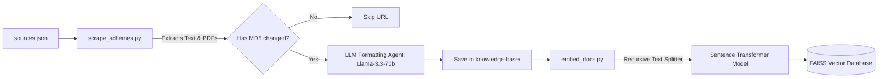

# 🤖 Data Ingestion, Processing, & Testing Agents Guide

This guide details the background agents and scripts responsible for populating the database, indexing files for search, creating fine-tuning datasets, and executing automated pipeline tests. The primary files discussed are:
1. **Scraping Agent**: [scrape_schemes.py](file:///c:/Users/Deepti%20Prasad/Desktop/disability-schemes-chatbot/scripts/scrape_schemes.py)
2. **Indexing & Update Agents**: [embed_docs.py](file:///c:/Users/Deepti%20Prasad/Desktop/disability-schemes-chatbot/scripts/embed_docs.py) & [update_all.py](file:///c:/Users/Deepti%20Prasad/Desktop/disability-schemes-chatbot/scripts/update_all.py)
3. **Dataset Generator Agent**: [prepare_finetune_data.py](file:///c:/Users/Deepti%20Prasad/Desktop/disability-schemes-chatbot/scripts/prepare_finetune_data.py)
4. **Verification Testing Agent**: [test_logic.py](file:///c:/Users/Deepti%20Prasad/Desktop/disability-schemes-chatbot/scripts/test_logic.py)

---

## 🏗️ Ingestion & Indexing Pipeline

The background ingestion system downloads official government pages, structures them, and indexes them into the vector database.

---

## 🕷️ Ingestion & Formatting Agent: `scrape_schemes.py`

This agent handles web scraping and structures unstructured government documents into clean Markdown.

### 1. Ingestion Phase
* The agent reads target portals from [sources.json](file:///c:/Users/Deepti%20Prasad/Desktop/disability-schemes-chatbot/knowledge-base/sources.json).
* It downloads page contents using `requests` or processes PDF links using `pypdf.PdfReader` to extract raw text page-by-page.
* It calculates the MD5 hash of the raw text and checks it against [seen_hashes.json](file:///c:/Users/Deepti%20Prasad/Desktop/disability-schemes-chatbot/scripts/seen_hashes.json). If the hash matches, it skips the URL to save API tokens.

### 2. LLM Structuring Phase
* If changes are detected, the agent sends the raw text to `llama-3.3-70b-versatile` on Groq.
* The LLM acts as an agent to extract scheme details and format them into structured Markdown containing:
  - **YAML Frontmatter Parameters**: `scheme_name`, `ministry`, `category`, `disability_types`, `last_updated`, and `source_url`.
  - **Standard Headers**: `## Overview`, `## Benefits`, `## Eligibility criteria`, `## Required documents`, `## How to apply`, and `## Contact`.
  - **Multi-Scheme Splitting**: If multiple schemes are found, the LLM splits them using `---NEXT SCHEME---`.

### 3. File System Storage
* The scheme name is converted into an alphanumeric URL-friendly slug.
* Files are saved to `knowledge-base/<category>/<slug>-<date>.md`. If a filename collision occurs, it appends a counter (`_1`, `_2`) to prevent overwriting existing data.
* The script updates `seen_hashes.json` with the new MD5 hash.

---

## 📂 Indexing & Update Agents: `embed_docs.py` & `update_all.py`

Once documents are stored, they must be converted into vector embeddings for semantic search.

### 1. Chunking & Indexing (`embed_docs.py`)
* **Loading**: Recursively loads all `.md` files under `knowledge-base/` using LangChain's `DirectoryLoader` and `TextLoader`.
* **Splitting**: Segments documents into 500-character blocks with 50-character overlap using `RecursiveCharacterTextSplitter`. Splitting prioritizes Markdown markers (`\n##`, `\n###`, `\n-`) to preserve table lists and bullet points.
* **Vector Generation**: Generates 384-dimensional vector embeddings using the `all-MiniLM-L6-v2` Sentence Transformer model.
* **Save**: Writes the compiled index to [scripts/vector_store/](file:///c:/Users/Deepti%20Prasad/Desktop/disability-schemes-chatbot/scripts/vector_store/) (saving `index.faiss` and `index.pkl`).

### 2. Update Coordinator (`update_all.py`)
* Orchestrates the update pipeline by running `scrape_schemes.py` first, followed by `embed_docs.py` as separate subprocesses.
* Can be run via the Windows batch script [run_updates.bat](file:///c:/Users/Deepti%20Prasad/Desktop/disability-schemes-chatbot/run_updates.bat) located in the project root.

---

## 🎯 Fine-Tuning Dataset Generator: `prepare_finetune_data.py`

This script parses the Markdown database to generate instruction-tuning data. This is useful for training custom models (e.g., using Unsloth or HuggingFace TRL).
* It reads all files under `knowledge-base/` and generates three instruction-tuning pairs for each scheme:
  1. **General Info**: `Provide a detailed overview of the <Scheme Name>.` $\rightarrow$ Outputs the full Markdown content.
  2. **Benefits**: `What are the benefits provided under the <Scheme Name>?` $\rightarrow$ Outputs the parsed `## Benefits` section.
  3. **Eligibility**: `Who is eligible for the <Scheme Name> in India?` $\rightarrow$ Outputs the parsed `## Eligibility criteria` section.
* **Output**: Saves the dataset as an Alpaca-style JSONL file at [finetune_dataset.jsonl](file:///c:/Users/Deepti%20Prasad/Desktop/disability-schemes-chatbot/scripts/finetune_dataset.jsonl).

---

## 🧪 Verification & Testing Agent: `test_logic.py`

To prevent regression errors in the RAG pipeline, this script runs automated test assertions on the system response.
* **Query**: Test query asks about a child who cannot study due to a mental disability.
* **Assertions**:
  - Verifies that the RAG model does not suggest educational scholarships or student-only benefits.
  - Checks if the response contains the keywords `"scholarship"` or `"student"`. If they are present, it verifies that the model explicitly acknowledged the constraint with the phrase `"since your child cannot pursue education"`.
  - If the model recommends student benefits without acknowledging the constraint, the test prints a failure log to alert developers.
