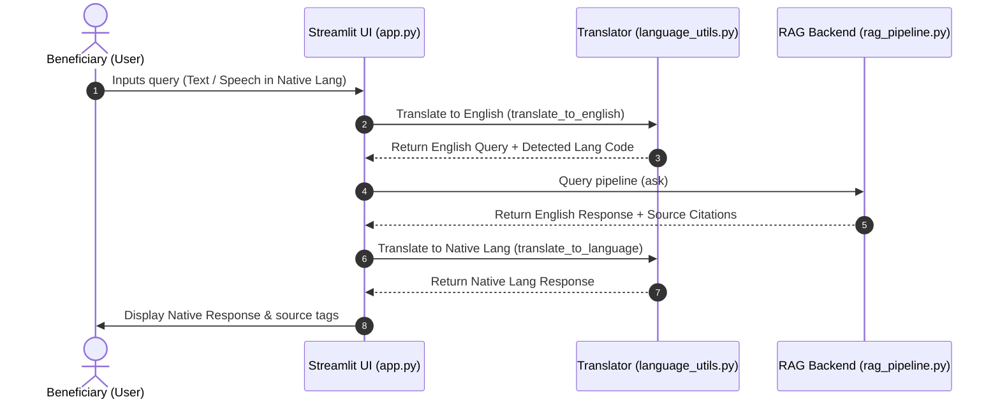

# 🖥️ Frontend UI & Translation Layer Guide

This guide details the frontend user interface and translation system that enables multilingual conversation. The primary files discussed are:
1. **User Interface**: [app.py](file:///c:/Users/Deepti%20Prasad/Desktop/disability-schemes-chatbot/chatbot/app.py)
2. **Translation Engine**: [language_utils.py](file:///c:/Users/Deepti%20Prasad/Desktop/disability-schemes-chatbot/chatbot/language_utils.py)
3. **Legacy Translation Engine**: [translate.py](file:///c:/Users/Deepti%20Prasad/Desktop/disability-schemes-chatbot/scripts/translate.py)

---

## 🔁 User Request Lifecycle

The diagram below details the flow of a single user message (either text or spoken voice) through the frontend translation boundary:



---

## 📱 User Interface: `chatbot/app.py`

The frontend is built using **Streamlit**, configured for wide screens, and styled with injected CSS.

### Key Capabilities
1. **Visual Style**: Injected CSS styles chat bubbles (`stChatMessage`) with rounded corners (`15px`) and renders gray background source tags (`source-tag`) for cited documents.
2. **Multilingual Dropdown Selector**: The sidebar features a selectbox containing a list of 13 supported languages. Choosing a language updates the system language code used for recording and translation.
3. **Voice Recording Integration**: Uses `streamlit_mic_recorder`'s `speech_to_text` function to let users click and dictate questions directly into their microphone. The recorder is configured with the selected language code so Google Speech-to-Text can parse the audio correctly.
4. **Session State Memory**: Chat message logs are kept inside the Streamlit session buffer (`st.session_state.messages`) to render past responses and feed conversation history into the RAG model.

### Main Processing Loop
* The UI waits for user input from the chat input textbox (`st.chat_input`) or a spoken transcript (`voice_text`).
* The system adds the question to the message log, displays it in the chat window, and starts a spinner.
* It invokes `translate_to_english` to standardise the input.
* It queries the backend pipeline, passing along the chat history (excluding the current user question) so the model retains conversation context:
  ```python
  result = ask(english_question, chat_history=st.session_state.messages[:-1])
  ```
* It receives `result["answer"]` (English response) and `result["sources"]` (matching filenames) from the RAG pipeline.
* The translation module converts the answer back to the user's selected language.
* The response and its corresponding source files are saved to session state and rendered to the page.

---

## 🌐 Multilingual Engine: `chatbot/language_utils.py`

To support users across diverse language groups, the application handles translations using the `deep_translator` library (backed by Google Translate).

### 1. Supported Languages
The following 13 languages are mapped to their respective ISO 639-1 language codes:
* **English** (`en`), **Hindi** (`hi`), **Tamil** (`ta`), **Telugu** (`te`), **Marathi** (`mr`), **Bengali** (`bn`), **Gujarati** (`gu`), **Kannada** (`kn`), **Malayalam** (`ml`), **Punjabi** (`pa`), **Odia** (`or`), **Assamese** (`as`), **Urdu** (`ur`).

### 2. Main Functions

* **`translate_to_english(text: str) -> (translated_text, detected_lang_code)`**
  * Automatically detects the source language and translates the input to English.
  * *Fallback*: If translation fails, returns the original text and `"en"`.

* **`translate_to_language(text: str, lang_code: str) -> str`**
  * Translates the final response from English back to the user's selected language.
  * If the target is English (`"en"`), `None`, or translation encounters an exception, it returns the original English string.

* **`get_language_code(language_name: str) -> str`**
  * Utility helper to extract the ISO code for a display language name (e.g., `"Tamil"` $\rightarrow$ `"ta"`).

---

## ⚠️ Script Divergence note: `scripts/translate.py`

There is a separate file called [translate.py](file:///c:/Users/Deepti%20Prasad/Desktop/disability-schemes-chatbot/scripts/translate.py) located in the scripts folder.
* **Scope**: It contains similar translation methods but supports only a subset of 11 languages (lacks Odia, Assamese, and Urdu).
* **Usage**: This is a legacy script. Always use [language_utils.py](file:///c:/Users/Deepti%20Prasad/Desktop/disability-schemes-chatbot/chatbot/language_utils.py) for frontend changes and new pipeline development.
