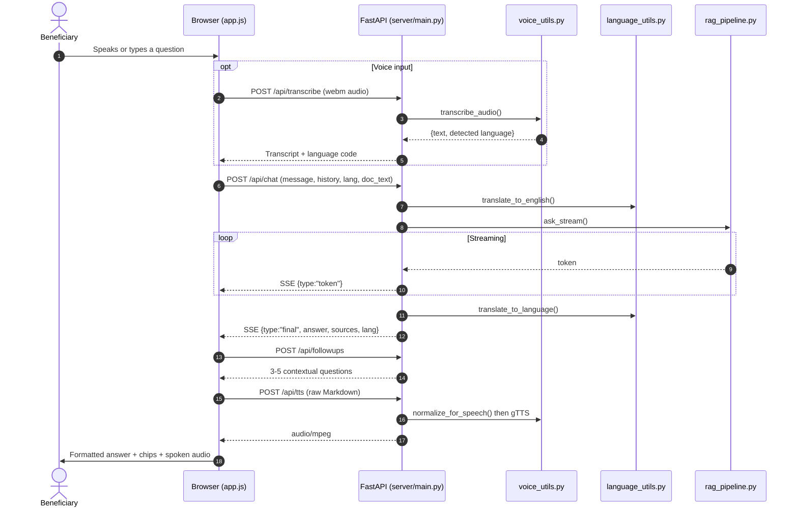

# 🖥️ Frontend, API & Voice Guide

This guide covers the web layer: the FastAPI backend, the vanilla-JS client, voice input/output, follow-up suggestions, accessibility, and translation. Files discussed:

1. **API server**: `server/main.py`
2. **Client**: `frontend/index.html`, `frontend/style.css`, `frontend/app.js`
3. **Voice utilities**: `chatbot/voice_utils.py`
4. **Translation engine**: `chatbot/language_utils.py`
5. **Legacy Streamlit UI**: `chatbot/app.py`

---

## 🔁 User Request Lifecycle



---

## 🌐 API Reference (`server/main.py`)

| Endpoint | Method | Purpose |
|---|---|---|
| `/api/health` | GET | Liveness probe; returns the supported-language map used to populate the UI dropdown. |
| `/api/chat` | POST | Streams the answer as Server-Sent Events. |
| `/api/followups` | POST | Returns 3–5 contextual follow-up questions for the latest turn. |
| `/api/transcribe` | POST | Multipart audio → `{text, lang}` via Whisper. |
| `/api/tts` | POST | `{text, lang}` → `audio/mpeg`. Returns **204** when the language has no voice. |
| `/api/upload` | POST | PDF/TXT/MD → extracted plain text for document Q&A. |
| `/` | GET | Serves the static single-page frontend. |

### Streaming contract (`/api/chat`)

The English generation is streamed token-by-token for a live typing effect, then a single `final` event carries the translated answer and metadata:

```jsonc
{"type": "token", "text": "..."}          // repeated
{"type": "final",
 "answer": "...",             // translated into the user's language
 "english": "...",            // English original (fed to follow-up generation)
 "english_question": "...",   // English question (fed to follow-up generation)
 "sources": ["scheme.md"],
 "lang": "hi",
 "tts_available": true}
{"type": "error", "message": "..."}       // on failure
```

Static files are mounted **last** so `/api/*` routes take precedence over the catch-all mount.

---

## 📱 The Client (`frontend/app.js`)

Plain ES2020 — no framework, no bundler, no build step.

### Key capabilities

1. **Streaming rendering** — `readSSE()` parses the SSE body from `fetch`, re-rendering Markdown on each token. A three-dot typing indicator shows before the first token arrives.
2. **Conversation management** — multiple conversations persist in `localStorage`, auto-titled from the first message. Audio blobs are stripped before persisting (they are not serialisable).
3. **Follow-up chips** — after each answer, `loadFollowups()` fetches contextual questions and renders them as clickable pills. Chips belong to the **latest turn only**: they are cleared when a new message is sent, so suggestions always reflect the current topic.
4. **Voice input** — the `MediaRecorder` API records WebM audio and posts it to `/api/transcribe`. The detected language is then forced as the reply language for that turn.
5. **Voice output** — the **raw Markdown** is posted to `/api/tts`; the server normalises it. Playback uses a native `<audio controls>` element, which is keyboard- and screen-reader-accessible for free (play/pause/seek/replay).
6. **Document Q&A** — an uploaded file is extracted server-side and attached to subsequent questions as `doc_text`.
7. **Markdown + code** — rendered with `marked`, highlighted with `highlight.js` (CDN; can be vendored for offline use).

### Response formatting (`frontend/style.css`)

The LLM is instructed to emit structured Markdown, which the stylesheet renders as a polished document: `##` headings with underline rules, accent-coloured list markers and step numbers, bold key facts, accent-bordered blockquote callouts, styled tables, and source pills. Messages fade in; chips animate in with a stagger.

### Accessibility

- Skip link to the message box; `role="log"` + `aria-live="polite"` on the transcript.
- `aria-label` on every icon control; `aria-pressed` on the mic; `aria-current` on the active conversation.
- Visible `:focus-visible` outlines throughout; full keyboard operation (Enter sends, Shift+Enter newlines).
- `prefers-reduced-motion` disables all animation.
- `prefers-color-scheme` light/dark themes; responsive down to mobile with a collapsible sidebar.

---

## 🎙️ Voice Engine (`chatbot/voice_utils.py`)

### `transcribe_audio(audio_bytes, filename) -> (text, lang_code)`
Sends the clip to Groq **`whisper-large-v3`** with `response_format="verbose_json"`. Whisper detects the spoken language itself and handles code-switching — a decisive advantage over the browser Web Speech API, which requires the language to be fixed in advance. Whisper's language name (e.g. `"hindi"`) is mapped to an ISO-639-1 code. Returns `("", None)` on failure so the UI can prompt a retry.

### `normalize_for_speech(text) -> str`
Converts Markdown into text that **sounds** natural. Without it, TTS reads "asterisk asterisk" and "hash". It removes code fences, inline code, images, URLs, emoji, headings, bullets, numbering, bold/italic markers, blockquote arrows and table pipes — then terminates every line with a full stop so the engine **pauses between sections** instead of running everything together.

> Example: `## 💰 Financial benefits\n- **75% concession** on fare`
> becomes: `Financial benefits. 75% concession on fare.`

### `synthesize_speech(text, lang_code) -> bytes | None`
Normalises the text, then synthesises MP3 via gTTS. Returns `None` for languages gTTS cannot speak (**Odia** and **Assamese**) rather than mispronouncing them with an English voice — the UI then shows a "voice output isn't available" note. Upgrade path: swap in Azure/Google Cloud/ElevenLabs for premium voices and full coverage.

---

## 🌐 Translation Engine (`chatbot/language_utils.py`)

### Supported languages (13)
English (`en`), Hindi (`hi`), Tamil (`ta`), Telugu (`te`), Marathi (`mr`), Bengali (`bn`), Gujarati (`gu`), Kannada (`kn`), Malayalam (`ml`), Punjabi (`pa`), Odia (`or`), Assamese (`as`), Urdu (`ur`).

### Functions

- **`translate_to_english(text) -> (translated, detected_code)`** — normalises input to English for retrieval quality. Falls back to the original text on failure.
- **`translate_to_language(text, lang_code) -> str`** — translates the answer back. Returns the input unchanged for `en`/`None`/errors.
- **`detect_language(text) -> str`** — `langdetect` with a fixed seed for deterministic results. Returns only supported codes, else `"en"`. Used for typed input when the language selector is on **Auto-detect**.
- **`get_language_code(name) -> str`** — display name → ISO code.

**Language resolution order:** an explicit sidebar override wins; otherwise the language Whisper detected from speech; otherwise `detect_language()` on typed text. The user therefore never has to choose a language.

---

## ⚠️ Legacy notes

- **Streamlit UI (removed)** — the original `chatbot/app.py` has been deleted. Streamlit's rerun-per-interaction model could not do true token streaming or full ARIA control, which is why the FastAPI + vanilla stack replaced it.
- **`scripts/translate.py`** — legacy translation helper covering only 11 languages. Use `chatbot/language_utils.py` for all new work.
