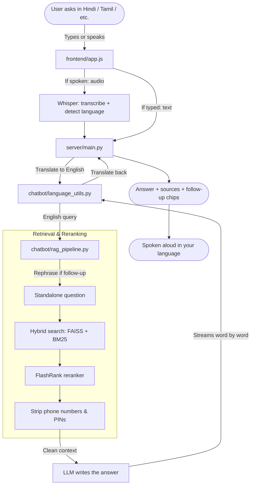

# ♿ Project Brief: Disability Schemes Chatbot

This project is a smart search assistant. It helps persons with disabilities in India find the right government welfare schemes. Instead of reading long, confusing legal documents, users can simply **ask a question by typing or speaking, in their own language**, and get a clear, structured answer read back to them aloud.

Here is how the project works, in the simplest terms.

---

## 📂 The Core Components

### 1. 🔍 The Search Engine (RAG)
**Its job**: look up the official rules.
* **Where it lives**: `chatbot/rag_pipeline.py` and `scripts/vector_store/`
* **What it does**: two search tools (**FAISS** for meaning and **BM25** for exact keywords) search a local library of Markdown files in `knowledge-base/` and pull out the exact paragraphs about the scheme you need. A reranker (**FlashRank**) then sorts them so the best passage comes first.
* **Why**: it guarantees the chatbot answers only from official government data, so it cannot invent fake benefits.

### 2. 🧠 The Writer (LLM)
**Its job**: read the search results and explain them to you.
* **Where it lives**: configured in `chatbot/rag_pipeline.py`
* **What it does**: takes the raw paragraphs, simplifies the legal language, and writes a clean answer with headings, bullet points, numbered steps, and **bold amounts** so it is easy to skim. Strict rules stop it from guessing your age or income, or mistaking a phone number for a grant amount.
* **Swappable**: normally the Llama 3.1 model on Groq, but it can run a **fully local** model instead (see below).

### 3. 🗣️ The Voice (Speech in and out)
**Its job**: let you talk to the assistant instead of typing.
* **Where it lives**: `chatbot/voice_utils.py`
* **What it does**:
  * **Listening** — records your voice and sends it to **Whisper**, which writes down what you said *and works out which language you spoke, on its own*. You never have to pick a language from a menu.
  * **Speaking** — reads the answer back aloud in your language. Before speaking, it cleans out all the formatting symbols, so it says *"Financial benefits. 75% concession on fare."* instead of *"hash hash asterisk asterisk 75% concession"*.

### 4. 🌐 The Translator
**Its job**: let you ask in your mother tongue.
* **Where it lives**: `chatbot/language_utils.py`
* **What it does**: supports **13 Indian languages**. It translates your question into English (so the search engine can match English documents), then translates the answer back into your language.

### 5. 🖥️ The Web Page
**Its job**: the chat screen you see in your browser.
* **Where it lives**: `server/main.py` (the server) and `frontend/` (the page itself)
* **What it does**: draws the chat, streams the answer word-by-word as it is written, keeps a sidebar of past conversations, lets you upload a document to ask about, and shows **clickable follow-up question suggestions** under every answer. It is built to be usable with a keyboard and a screen reader.

---

## ⚙️ How the System Works (Step by Step)



---

## 💡 What Makes It Feel Intelligent

* **It remembers.** If you already said your daughter is 12 and cannot study, it will not ask again — and it will not suggest school scholarships.
* **It asks only when needed.** A vague question gets a short overview plus at most two clarifying questions. A specific question gets a direct answer with no interrogation.
* **It suggests what to ask next.** After every answer, 3–5 clickable questions appear — *"What documents are required?"*, *"Is there an online application process?"* — and they change to match whatever you are discussing now.
* **It never has to be told your language.** Speech and text are both detected automatically.

---

## 🤖 Background Helper Tools (`scripts/`)

* **`scrape_schemes.py`** — a web robot that downloads pages and PDFs from official portals, uses a large AI model to clean the raw text, and saves structured Markdown into `knowledge-base/`.
* **`embed_docs.py`** — breaks those files into small chunks and builds the vector database the search engine uses.
* **`update_all.py` / `run_updates.bat`** — updates everything in one click: scrape first, then rebuild the index.
* **`prepare_finetune_data.py`** — generates question/answer pairs for training a custom model later.
* **`test_logic.py`** — checks the safety rules still hold; for example, that asking about a child who cannot study does **not** produce scholarship suggestions.

GitHub Actions run the scraper **monthly** and rebuild the index automatically whenever the knowledge base changes.

---

## 🔧 If the Chatbot Says "Access denied"

If you see `403 — Access denied. Please check your network settings`, the Groq AI service is refusing your connection because you are on a **VPN or proxy** (Groq blocks those IP addresses). Your API key is fine — nothing in the code is broken.

**Fix it by** disconnecting the VPN, or by running the AI model on your own computer instead:

```bash
ollama pull llama3.1      # after installing Ollama
# then in .env:  LLM_PROVIDER=ollama
```
