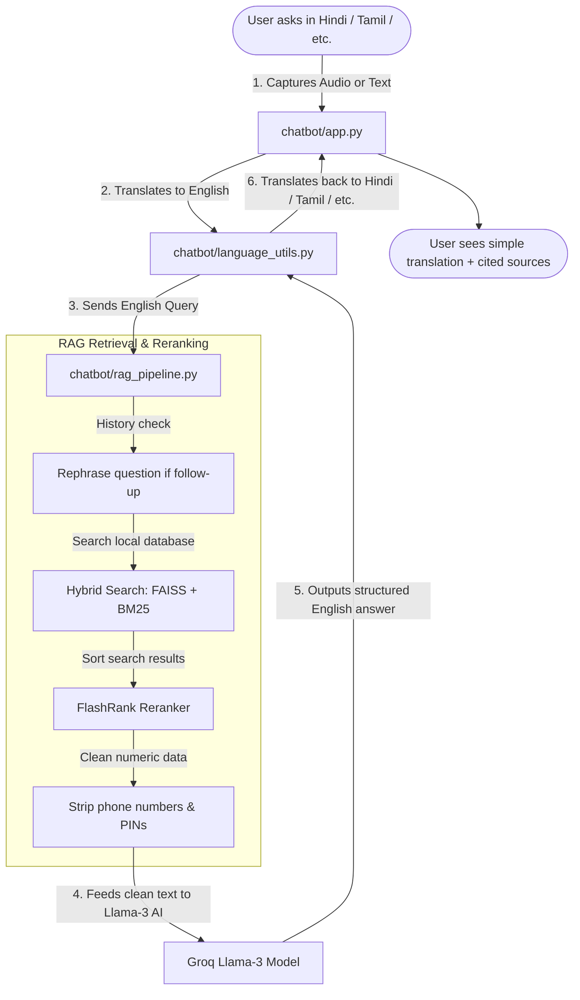

# ♿ Project Brief: Disability Schemes Chatbot

This project is a smart search assistant. It helps persons with disabilities in India find the right government welfare schemes. Instead of reading long, confusing legal documents, users can just ask questions in their native language and get simple, structured answers.

Here is how this specific project works, explaining what each folder and file does in the simplest way possible.

---

## 📂 The Core Components of This Project

### 1. 🔍 The Search Engine (RAG)
**What RAG does in this project**: It acts as the search engine that looks up official rules.
* **Where it lives**: `chatbot/rag_pipeline.py` and `scripts/vector_store/`
* **What it does**: When you ask a question, the code search tools (called **FAISS** and **BM25**) search through a local library of markdown files (`knowledge-base/`). It pulls out the exact paragraphs that mention the scheme you need.
* **Why we use it**: It guarantees the chatbot only answers using official government data, so it doesn't make up fake benefits.

### 2. 🧠 The Writer & Explainer (LLM)
**What the LLM does in this project**: It acts as the brain that reads the search results and explains them to you.
* **Where it lives**: Configured in `chatbot/rag_pipeline.py` (which calls the **Llama-3** AI model on Groq) and guided by formatting rules in `chatbot/prompts.py`.
* **What it does**: It reads the raw paragraphs found by the search engine, simplifies the complicated language, and writes a clean, step-by-step answer. It formats every scheme answer in a standard layout: *Overview*, *Benefits*, *Eligibility*, *Required Documents*, *How to Apply*, and *Source URL*.

### 3. 🌐 The Translator (Multilingual Layer)
**What the translator does in this project**: It allows users to ask questions in their mother tongue.
* **Where it lives**: `chatbot/language_utils.py` (and the helper file `scripts/translate.py`)
* **What it does**: It uses Google Translate behind the scenes to support **13 Indian languages** (including Hindi, Tamil, Telugu, Marathi, and Bengali).
  * It translates your native question into English (so the search engine can match it with English documents).
  * It translates the AI's English reply back into your language before showing it on screen.

### 4. 🖥️ The Web Page (Streamlit Frontend)
**What the frontend does in this project**: It is the visual chat screen you see on your browser.
* **Where it lives**: `chatbot/app.py`
* **What it does**: It draws the user interface, renders the chat bubble messages, holds the settings sidebar, and handles voice search (letting you click **"Click to Speak"** and talk directly into your microphone).

---

## ⚙️ How the System Works (Step-by-Step Flow)

Here is the exact journey of a user's question through the project's code files:

---

## 🤖 Other Helper Tools in this Project

This repository also contains automation scripts in the `scripts/` folder that act as background helpers:

* **`scripts/scrape_schemes.py` (The Scraper)**: 
  A web robot that downloads text and PDFs from official portals, uses a large AI model to clean the raw text, and saves them as structured markdown files inside the `knowledge-base/` folder.
* **`scripts/embed_docs.py` (The Indexer)**: 
  A script that breaks the text files in the knowledge base into small chunks and generates vector databases so the search engine can find them instantly.
* **`scripts/update_all.py` & `run_updates.bat` (The Orchestrators)**: 
  Allows you to update the entire bot in one click. It runs the scraper first, then rebuilds the search index.
* **`scripts/prepare_finetune_data.py` (The Training Prep)**: 
  Generates a list of questions and answers from the files to help train a custom AI model in the future.
* **`scripts/test_logic.py` (The Tester)**: 
  Checks if the RAG search obeys special rules. For example, if you ask about a child who cannot study, it tests that the bot successfully blocks school scholarship suggestions and recommends care homes instead.
